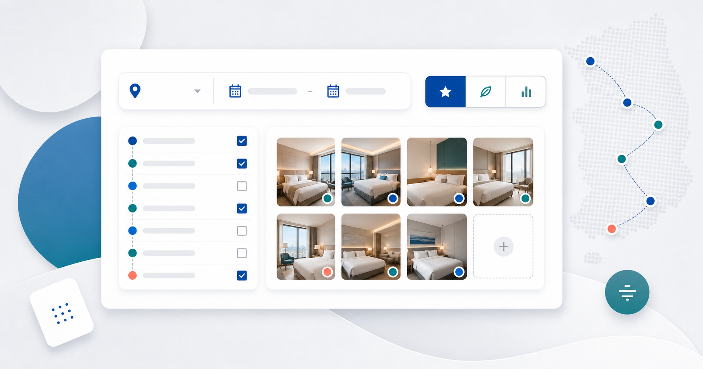

# 한국 토요코인 객실 조회

[简体中文](README.md) | [English](README.en.md) | [日本語](README.ja.md) | [한국어](README.ko.md)

한국의 토요코인 호텔을 지역별로 선택하고 실시간 객실 현황, 객실 유형, 숙박 플랜과 공식 가격을 한 번에 비교합니다. 이 사이트는 검색과 비교만 제공하며 실제 예약은 토요코인 공식 웹사이트에서 진행합니다.



## 데모

- Vercel: [toyoko-inn-korea-availability.vercel.app](https://toyoko-inn-korea-availability.vercel.app)

## 주요 기능

- 한국 7개 도시의 토요코인 13개 지점을 지원하며 지역 전체 또는 개별 호텔을 선택할 수 있습니다.
- 체크인/체크아웃 날짜, 객실당 성인 수, 객실 수, 흡연 선호를 한 번만 입력합니다.
- 사용자가 검색을 실행할 때만 공식 사이트에 요청하며 백그라운드 모니터링이나 자동 예약은 하지 않습니다.
- 최대 3개 호텔을 동시에 조회하고 호텔별 진행 상황을 표시합니다. 한 호텔의 실패는 다른 결과에 영향을 주지 않습니다.
- 객실 있음, 매진, 흡연 조건 불일치, 조회 실패를 구분하며 호텔별 재시도를 지원합니다.
- 객실 유형, 숙박 플랜, 일반/회원 가격, KRW 숙박 합계와 공식 예약 링크를 표시합니다.
- 브라우저에는 최근 검색 조건 10개만 저장하고 재고나 가격 결과는 저장하지 않습니다.
- 중국어 간체, 영어, 일본어, 한국어를 지원하며 오른쪽 위의 눈에 잘 띄는 메뉴에서 전환할 수 있습니다.

## 사용 방법

1. 오른쪽 위 언어 전환 메뉴에서 표시 언어를 선택합니다.
2. 지역을 펼친 뒤 하나 이상의 호텔을 선택합니다.
3. 날짜, 객실당 성인 수, 객실 수와 흡연 선호를 설정합니다.
4. 객실 조회를 시작하고 각 호텔의 결과를 확인합니다.
5. 전체 호텔, 객실 있음 또는 조회 실패 보기로 전환하고 필요하면 개별 호텔을 다시 조회합니다.
6. 원하는 플랜에서 공식 사이트로 이동해 최신 재고, 이용 자격과 최종 가격을 확인합니다.

## 다국어 지원

| 언어 | Locale |
| --- | --- |
| 중국어 간체 | `zh-CN` |
| English | `en-US` |
| 日本語 | `ja-JP` |
| 한국어 | `ko-KR` |

첫 방문 시 브라우저 언어에 맞춰 표시 언어를 선택하며 지원하지 않는 언어는 중국어 간체로 대체합니다. 사용자가 직접 선택한 언어는 `localStorage`와 동일 사이트 쿠키에 저장되어 새로고침 및 서버 렌더링에서도 유지됩니다. 날짜, 한국 시간과 KRW 통화는 locale에 맞게 표시되며 호텔명, 도시명, 화면 상태, 양식, 오류와 접근성 문구도 현지화됩니다.

공식 사이트에서 동적으로 반환하는 일본어 객실명과 숙박 플랜명은 원문을 유지하고, 공식 정보와 쉽게 대조할 수 있도록 현지화된 표시 이름을 함께 제공합니다.

## 로컬 실행

Node.js `>=22.13.0`이 필요합니다.

```bash
git clone https://github.com/chenyl0426/toyoko-inn-kr-availability.git
cd toyoko-inn-kr-availability
npm ci
npm run dev
```

개발 서버가 출력한 로컬 URL을 여세요. 현재 환경 변수, D1 데이터베이스 또는 R2 버킷은 필요하지 않습니다.

## 명령어

| 명령어 | 용도 |
| --- | --- |
| `npm run dev` | vinext 개발 서버 시작 |
| `npm run build` | ChatGPT Page / OpenAI Sites용 Cloudflare Worker 출력 빌드 |
| `npm run vercel-build` | Vercel에서 사용하는 Next.js 빌드 실행 |
| `npm test` | 빌드 후 서버 렌더링 회귀 테스트 실행 |
| `npm run lint` | ESLint 실행 |
| `npm run db:generate` | 추후 Drizzle schema를 활성화할 때 마이그레이션 생성 |

## 배포

### Vercel

`vercel.json`은 프레임워크를 Next.js로 지정하고 빌드 명령을 `npm run vercel-build`로 설정합니다. 이 GitHub 저장소를 Vercel로 가져오고 운영 브랜치를 `main`으로 지정한 뒤 `>=22.13.0`을 지원하는 Node.js 버전을 사용하세요. 현재 환경 변수는 필요하지 않습니다.

### ChatGPT Page / OpenAI Sites

프로젝트는 `.openai/hosting.json`, Sites Vite 플러그인과 Cloudflare Worker 호환 빌드로 ChatGPT Page를 지원합니다. `npm run build`로 빌드를 확인한 뒤 Codex / OpenAI Sites 게시 흐름을 통해 배포합니다. Sites 프로젝트 ID나 자격 증명을 공유하거나 관리되는 호스팅 바인딩을 직접 수정하지 마세요.

두 플랫폼은 같은 소스를 사용하지만 Vercel은 Next.js 빌드, ChatGPT Page는 vinext / Sites 빌드를 사용합니다.

## 프로젝트 구조

```text
app/                    페이지, 컴포넌트와 객실 조회 API
lib/                    호텔 설정, 타입, 다국어와 공식 사이트 어댑터
tests/                  서버 렌더링 회귀 테스트
public/                 아이콘과 소셜 미리보기 이미지
.openai/hosting.json    ChatGPT Page / OpenAI Sites 설정
vercel.json             Vercel 빌드 설정
```

## 데이터 및 면책 사항

이 프로젝트는 토요코인 공식 웹사이트가 아니며 토요코인이 운영하지 않습니다. 데이터는 공식 사이트의 공개 검색 흐름에서 가져오므로 재고와 가격은 언제든 바뀔 수 있습니다. 접근 제한, 추가 인증 요구 또는 페이지 구조 변경으로 조회가 실패할 수도 있습니다. 이 프로젝트는 로그인, 예약, 결제를 수행하지 않으며 계정, 쿠키, 재고 또는 가격을 저장하지 않습니다. 모든 예약 조건과 최종 가격은 토요코인 공식 웹사이트에서 다시 확인하세요.
